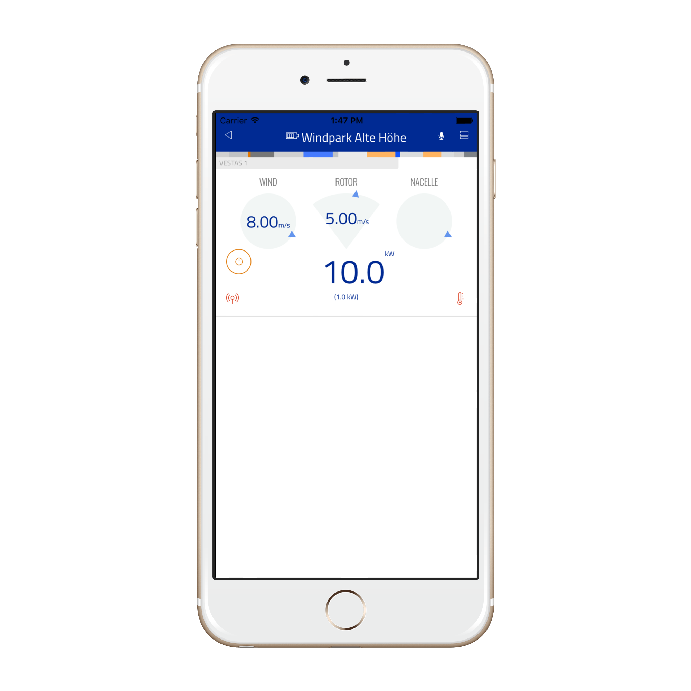

# thing-it-device-chp

[](https://nodei.co/npm/thing-it-device-chp/)
[](https://nodei.co/npm/thing-it-device-chp/)

[thing-it-node] Device Plugin for a generic Combined Heat and Power Unit (CHP) as a demo for CoGen Power Generation. Manufacturers of CHPs may use this as an example to implement
a [thing-it-node] Device Plugin for their CHP products.

## Installation

### Installation of NodeJS and [thing-it-node]

First, install node.js and **[thing-it-node]** on your Gateway Computer (e.g. Raspberry Pi or C.H.I.P) following the instructions on the [[thing-it-node] Wiki](https://github.com/marcgille/thing-it-node/wiki/Raspberry-Pi-Installation).
 
### Initialization and Start of [thing-it-node] 

The **[thing-it-device-chp]** Plugin is installed with **[thing-it-node]**, hence there is no need to install it separately.

The Plugin is simulation-only so far, hence you only have to create a directory in which you intend to run the configuration, e.g.
 
```
mkdir ~/chp-test
cd ~/chp-test
```

and invoke

```
tin init
```

and then start **[thing-it-node]** via

```
tin run
```

If you don't want to use Autodiscovery, you may use configurations like the [sample configuration]("./examples.configuration") via

```
tin example --device wind-turbine
```

If you want to pair the **[thing-it-node]** Gateway and its sample configuration with [thing-it.com](https://www.thing-it.com), invoke

```
tin pair --mesh Test
```

and enter your [thing-it.com](https://www.thing-it.com) account and password. The pairing will allow you to configure and monitor your local Gateway from 
[thing-it.com](https://www.thing-it.com) and use the Mobile App below to connect to the Gateway from everywhere.

## Mobile UI

Install the **thing-it Mobile App** from the Apple Appstore or Google Play and set it up to connect to **[thing-it-node]** 
locally as described [here](https://thing-it.com/thing-it/#/documentationPanel/mobileClient/connectionModes) or just connect your browser under 
[http://localhost:3001](http://localhost:3001) to check how the Mobile UI would look like.

The following screenshot shows the Node Page of the [sample configuration]("./examples.configuration") with the Mobile UI to monitor and control the CHP:

<p align="center"><a href="./documentation/images/mobile-ui.png"></a></p>

## Where to go from here ...

You may also be interested in

* Configuring additional [Devices](https://www.thing-it.com/thing-it/#/documentationPanel/mobileClient/deviceConfiguration), 
[Groups](https://www.thing-it.com/thing-it/#/documentationPanel/mobileClient/groupConfiguration), 
[Services](https://www.thing-it.com/thing-it/#/documentationPanel/mobileClient/serviceConfiguration), 
[Event Processing](https://www.thing-it.com/thing-it/#/documentationPanel/mobileClient/eventConfiguration), 
[Storyboards](https://www.thing-it.com/thing-it/#/documentationPanel/mobileClient/storyboard    Configuration) and 
[Jobs](https://www.thing-it.com/thing-it/#/documentationPanel/mobileClient/jobConfiguration) via your **[thing-it] Mobile App**.
* Use [thing-it.com](https://www.thing-it.com) to safely connect your Node Box from everywhere, manage complex configurations, store and analyze historical data 
and offer your configurations to others on the **[thing-it] Mesh Market**.
* Explore other Device Plugins like [Texas Instruments Sensor Tag](https://www.npmjs.com/package/thing-it-device-ti-sensortag), [Plugwise Smart Switches](https://www.npmjs.com/package/thing-it-device-plugwise) and many more. For a full set of 
Device Plugins search for **thing-it-device** on [npm](https://www.npmjs.com/). 
* Or [write your own Plugins](https://github.com/marcgille/thing-it-node/wiki/Plugin-Development-Concepts).
